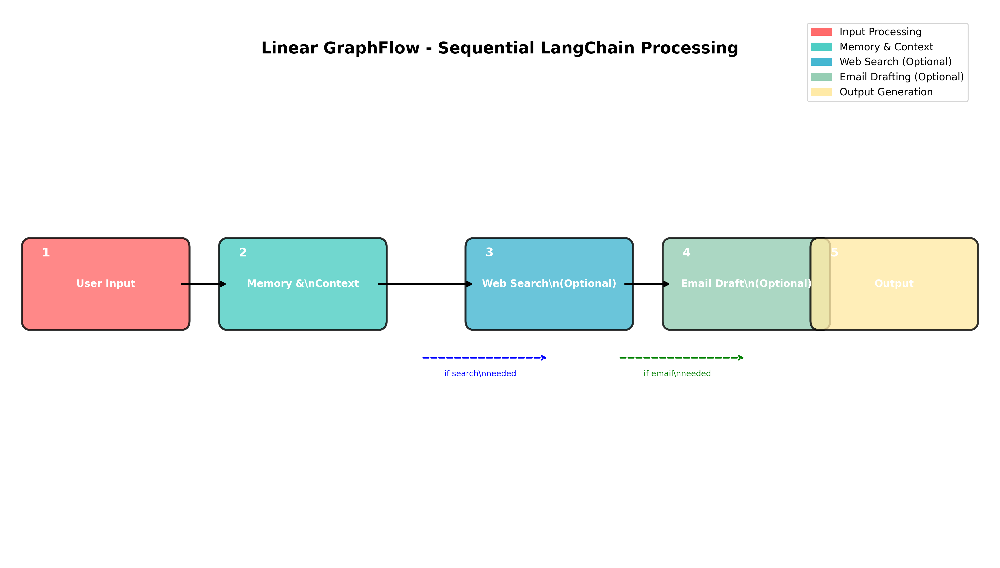
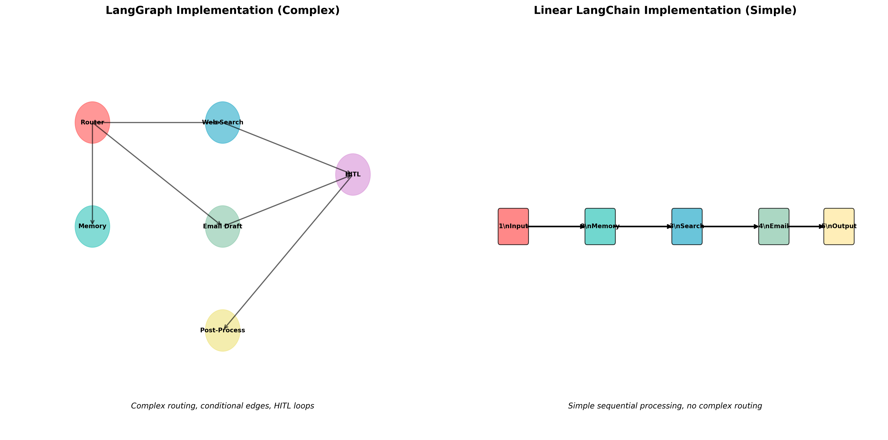

# Linear GraphFlow - Sequential LangChain Implementation

This is a **simplified, linear implementation** of the GraphFlow system using **LangChain** with **sequential processing** and **in-memory context management**.

## 🎯 Overview

The Linear GraphFlow processes user queries through a **simple sequential flow**:

```
User Input → Memory & Context → Web Search (Optional) → Email Drafting (Optional) → Output
```

Unlike the complex LangGraph implementation, this version uses:

- **LangChain chains** for sequential processing
- **In-memory context management** (no SQLite)
- **Simple conditional logic** for optional steps
- **Easy-to-understand linear flow**

## 🏗️ Architecture

### Linear Flow Diagram



### Architecture Comparison



## 📁 Files

- `linear_graphflow.py` - Main implementation with LangChain
- `test_linear_demo.py` - Demo script without API dependencies
- `visualize_linear_flow.py` - Creates flow diagrams
- `Linear_GraphFlow_Visualization.ipynb` - Jupyter notebook with visualizations
- `README_Linear_GraphFlow.md` - This documentation

## 🚀 Quick Start

### 1. Run the Demo (No API Keys Required)

```bash
python test_linear_demo.py
```

This demonstrates the linear flow with mock LLM responses.

### 2. Run with Real APIs

```bash
# Set up environment variables
export GOOGLE_API_KEY="your_gemini_api_key"
export SERPER_API_KEY="your_serper_api_key"

# Activate virtual environment
source myvenv/bin/activate

# Run the linear implementation
python linear_graphflow.py
```

### 3. View Visualizations

```bash
# Create diagrams
python visualize_linear_flow.py

# Open Jupyter notebook
jupyter notebook Linear_GraphFlow_Visualization.ipynb
```

## 🔧 Key Features

### 1. Sequential Processing

- **Step 1**: Memory & Context Retrieval
- **Step 2**: Web Search (if query needs external info)
- **Step 3**: Email Drafting (if query is email-related)
- **Step 4**: Output Generation

### 2. In-Memory Context Management

```python
class InMemoryContextManager:
    def __init__(self):
        self.conversation_history: List[Dict[str, Any]] = []
        self.current_context: Dict[str, Any] = {}
```

### 3. Conditional Steps

- **Web Search**: Triggered by keywords like "search", "find", "what is", "how to"
- **Email Drafting**: Triggered by keywords like "email", "draft", "write", "send"

### 4. Token Management

- Automatic context summarization when token limits are reached
- Uses tiktoken for accurate token counting

## 📊 Comparison with LangGraph

| Feature               | Linear GraphFlow | LangGraph       |
| --------------------- | ---------------- | --------------- |
| **Complexity**        | Simple           | Complex         |
| **Memory Usage**      | Low (in-memory)  | Higher (SQLite) |
| **Processing Speed**  | Fast             | Moderate        |
| **Maintainability**   | High             | Moderate        |
| **Debugging**         | Easy             | Complex         |
| **Development Speed** | Fast             | Slower          |

## 🎯 Use Cases

### Perfect for:

- **Simple conversational agents**
- **Email drafting assistants**
- **Research assistants with web search**
- **Prototyping and rapid development**
- **Educational purposes**
- **When you need straightforward sequential processing**

### Not ideal for:

- Complex multi-path workflows
- Advanced state management
- Human-in-the-loop interactions
- Complex conditional routing

## 🔍 Example Usage

```python
from linear_graphflow import LinearGraphFlow

# Initialize
graphflow = LinearGraphFlow()

# Process queries
result = graphflow.process_query("What is machine learning?")
print(result['response'])

result = graphflow.process_query("Draft an email to my team")
print(result['response'])

# View conversation history
history = graphflow.get_conversation_history()
print(f"Total interactions: {len(history)}")
```

## 📈 Processing Flow Examples

### Search Query

```
Input: "What is artificial intelligence?"
→ Memory: Retrieve context
→ Web Search: Search for AI information
→ Output: Comprehensive answer based on search results
```

### Email Query

```
Input: "Draft an email to schedule a meeting"
→ Memory: Retrieve context
→ Email Drafting: Generate email content
→ Output: Complete email draft
```

### Simple Query

```
Input: "Hello, how are you?"
→ Memory: Retrieve context
→ Output: Conversational response
```

## 🛠️ Technical Details

### Dependencies

- `langchain` - Core LangChain functionality
- `langchain-google-genai` - Google Gemini integration
- `langchain-community` - Community tools (Serper)
- `tiktoken` - Token counting
- `matplotlib` - Visualization
- `pandas` - Data analysis

### Environment Variables

```bash
GOOGLE_API_KEY=your_gemini_api_key
SERPER_API_KEY=your_serper_api_key
```

### Configuration

```python
# Token limit for context management
LIMIT_TOKENS = 1500

# LLM configuration
llm = ChatGoogleGenerativeAI(
    model="gemini-1.5-flash",
    temperature=0.7
)
```

## 🎨 Visualization

The implementation includes comprehensive visualizations:

1. **Linear Flow Diagram** - Shows the sequential processing steps
2. **Architecture Comparison** - Compares with LangGraph implementation
3. **Processing Steps Visualization** - Shows which steps are executed for each query
4. **Performance Metrics** - Compares different aspects of the implementations

## 🔄 Extending the Linear Flow

### Adding New Steps

```python
def custom_step(self, user_query: str, context: str):
    """Add your custom processing step"""
    # Your logic here
    return {"step": "custom", "result": "processed"}
```

### Modifying Conditional Logic

```python
# In memory_step method
needs_custom_step = any(keyword in user_query.lower() for keyword in
                       ["custom", "special", "unique"])
```

## 📝 Notes

- The linear implementation is **much simpler** than the LangGraph version
- **No complex state management** or conditional routing
- **Easy to understand and modify**
- **Perfect for learning** LangChain concepts
- **Great for prototyping** before moving to more complex systems

## 🤝 Contributing

Feel free to extend the linear implementation:

- Add new processing steps
- Improve the conditional logic
- Add more visualization features
- Enhance the context management

## 📚 Related Files

- `graphflow.py` - Original LangGraph implementation
- `web_app.py` - Web interface for the system
- `cli.py` - Command-line interface
- `config.py` - Configuration management

---

**Linear GraphFlow** provides a clean, efficient alternative to complex graph-based workflows when you need straightforward sequential processing with optional steps.
